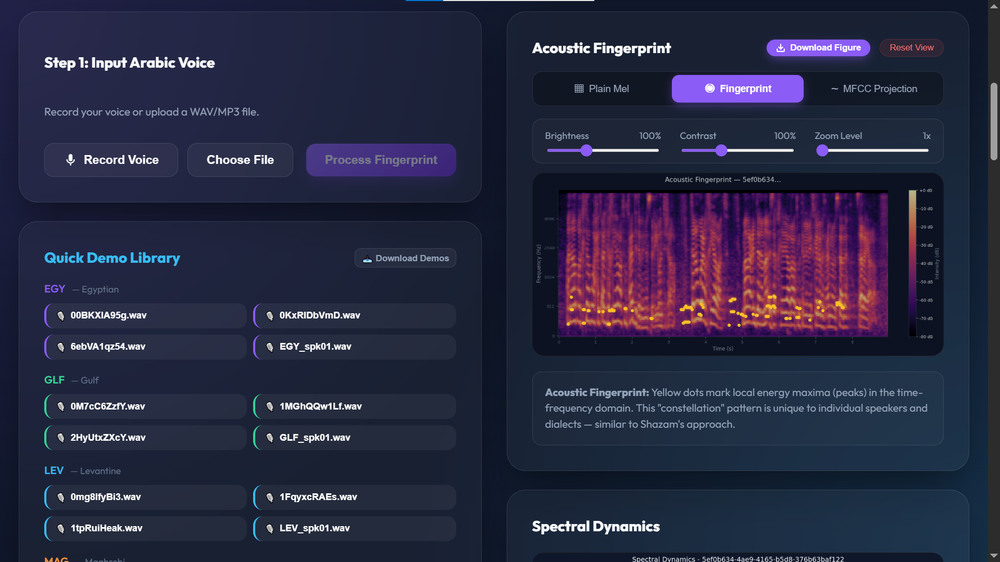
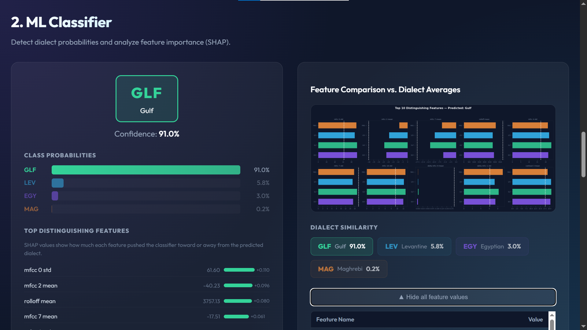
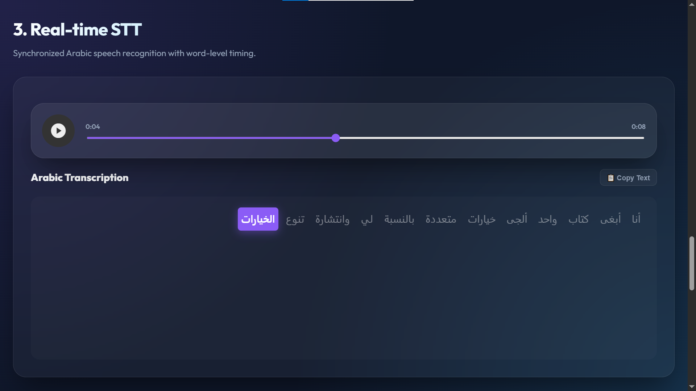
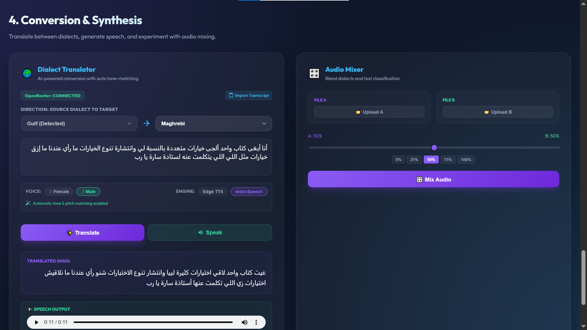

# 🌍 Arabic Dialect Fingerprint & AI Translator

<p align="center">
  
</p>

## 📖 Overview
**Arabic Dialect Fingerprint** is a comprehensive research and development platform designed to bridge the gap between regional Arabic dialects and modern AI speech technologies. By combining **Digital Signal Processing (DSP)**, **Deep Learning**, and **Neural Speech Synthesis**, this platform provides a 360-degree environment for detecting, analyzing, transcribing, and converting between the rich linguistic varieties of the Arabic language.

---

## 🖼️ Feature Gallery

| 🎙️ Audio Pipeline | 🧠 ML Classifier | ✍️ AI Transcriber | 🌍 Dialect Converter |
| :---: | :---: | :---: | :---: |
|  |  |  |  |
| *Visualizing DSP Features* | *Deep Learning Detection* | *Speech-to-Text* | *Regional Synthesis* |

---

## 🚀 Core Modules & Features

### 1. 🎙️ Advanced Audio Pipeline (DSP)
The heart of the system is its real-time signal processing engine. It transforms raw audio into a visual and mathematical "fingerprint."
- **Mel-Spectrogram Visualization**: High-resolution heatmaps showing frequency intensity over time.
- **Spectral Feature Tracking**: Real-time plotting of **Spectral Centroid** (brightness), **RMS Energy** (loudness), and **Zero-Crossing Rate**.
- **Acoustic Fingerprinting**: Identification of "Anchor Points" and peaks in the spectrogram to analyze the unique vocal signatures of different dialects.
- **Feature Evolution**: Dynamic charts showing how a speaker's tone and energy shift across a sentence.

### 2. 🧠 ML Dialect Classifier
Our Deep Learning model is trained on thousands of hours of regional speech data to identify the subtle nuances between major Arabic regions.
- **Multi-Dialect Support**: High-accuracy detection for **Egyptian (EGY)**, **Gulf (GLF)**, **Levantine (LEV)**, and **Maghrebi (MAG)**.
- **Explainable AI (SHAP)**: Integration with SHAP (SHapley Additive exPlanations) to show *which* frequency bands or time frames contributed most to the model's decision.
- **Probability Heatmaps**: Real-time confidence scores across all supported dialects.

### 3. ✍️ Intelligent AI Transcriber
A specialized STT (Speech-to-Text) engine optimized for the informal and non-standard nature of Arabic dialects.
- **Word-Level Sync**: The transcript highlights in real-time as the audio plays.
- **Dialectal Nuance Preservation**: Unlike standard STT, our engine captures regional slang and "Ammiya" (informal) expressions accurately.
- **Auto-Import**: Seamlessly push transcribed text directly into the translation module for conversion.

### 4. 🌍 Dialect-to-Dialect Converter (LLM + TTS)
Convert standard or regional Arabic into any other target dialect while maintaining the original meaning and emotional tone.
- **Slang Transformation**: Powered by **OpenRouter (GPT-4/Claude-3)**, the system converts formal text into authentic regional slang.
- **Neural Voice Synthesis**: Access to high-quality neural voices from **Edge-TTS** and **eidosSpeech**, mapped specifically to regional accents.
- **Automatic Voice Fingerprinting**: 
    - **Pitch Matching**: The system analyzes the original speaker's pitch and shifts the AI voice to match.
    - **Tone Filtering**: A dynamic EQ filter is applied to match the spectral "warmth" or "sharpness" of the source audio.

### 5. 🎛️ Hybrid Audio Mixer
A research tool designed to test the robustness of the ML classifier by creating "hybrid" dialects.
- **Real-Time Blending**: Mix two different dialect files with a slider (e.g., 60% Egyptian, 40% Levantine).
- **Stress Testing**: Re-classify the mixed output to see how the model handles code-switching and dialectal merging.

---

## 🛠️ Technical Architecture

### **The Backend (Python/FastAPI)**
- **Processing**: `librosa` for time-series analysis, `SciPy` for signal filtering.
- **Inference**: `PyTorch` for classification, `OpenRouter` for linguistic transformation.
- **Synthesis**: `edge-tts` and custom `eidosSpeech` API integration.

### **The Frontend (React/Vite)**
- **Engine**: React 18 with a custom high-performance state management system for 60fps audio visualizations.
- **Styling**: Premium **Glassmorphism** UI built with Vanilla CSS, featuring dynamic gradients and responsive layouts.
- **Visuals**: `Canvas API` and `SVG` for custom spectrogram overlays.

---

## 📥 Installation & Setup

### **Backend Requirements**
- Python 3.9+
- FFmpeg (for audio processing)
```bash
cd backend
python -m venv venv
source venv/bin/activate  # venv\Scripts\activate on Windows
pip install -r requirements.txt
python main.py
```

### **Frontend Requirements**
- Node.js 16+
```bash
cd frontend
npm install
npm run dev
```

---
## 🎨 Advanced DSP Features

### 🎙️ Automatic Voice Fingerprinting
The platform automatically analyzes the **Spectral Centroid** and **Median Pitch** of the original speaker. When generating a translated dialect, it applies:
- **Pitch Shifting**: Adjusts semitones to match the original speaker's tone.
- **Spectral Filtering**: Applies a dynamic EQ to match the "warmth" or "brightness" of the source audio.

### 🧪 Audio Mixer
The mixer allows you to blend two different dialect recordings and observe how the ML classifier reacts to "hybrid" dialects in real-time.
---

## 🌟 Why This Project?
Traditional Arabic NLP focuses heavily on Modern Standard Arabic (MSA), which is rarely spoken in daily life. This project prioritizes **"Ammiya"** (Spoken Arabic), providing tools that respect and preserve the linguistic diversity of the Arab world through the lens of modern technology.

---

## 📝 License & Attribution
Developed for the **Arabic Dialect Fingerprint Research Project**. 
- **Owner**: Member 4 (DSP/AI Integration)
- **License**: MIT
